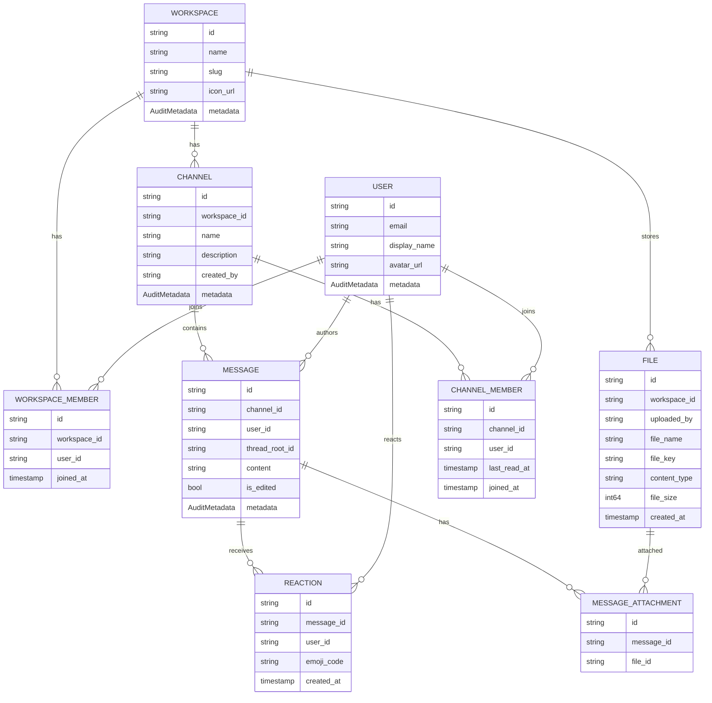

# AIon-Copilot
# Model ER図・構成・設計（chatapp model/v1）

## ER図（Mermaid）

---

## モデル構成（ファイル一覧）
- Model定義: [proto/chatapp/model/v1](proto/chatapp/model/v1)
  - [proto/chatapp/model/v1/workspace.proto](proto/chatapp/model/v1/workspace.proto)
  - [proto/chatapp/model/v1/workspace_member.proto](proto/chatapp/model/v1/workspace_member.proto)
  - [proto/chatapp/model/v1/user.proto](proto/chatapp/model/v1/user.proto)
  - [proto/chatapp/model/v1/channel.proto](proto/chatapp/model/v1/channel.proto)
  - [proto/chatapp/model/v1/channel_member.proto](proto/chatapp/model/v1/channel_member.proto)
  - [proto/chatapp/model/v1/message.proto](proto/chatapp/model/v1/message.proto)
  - [proto/chatapp/model/v1/reaction.proto](proto/chatapp/model/v1/reaction.proto)
  - [proto/chatapp/model/v1/file.proto](proto/chatapp/model/v1/file.proto)
  - [proto/chatapp/model/v1/message_attachment.proto](proto/chatapp/model/v1/message_attachment.proto)
- 共通メタ情報: [proto/chatapp/common/v1/metadata.proto](proto/chatapp/common/v1/metadata.proto)

---

## 設計のポイント（全体）
- **Workspace を起点に構造化**
  - Workspace → Channel / WorkspaceMember / File がぶら下がる。
- **User は Workspace/Channel/Message/Reaction に参加**
  - WorkspaceMember/ChannelMember で参加関係を表現。
  - Message/Reaction でアクティビティを表現。
- **Message は Channel に属する**
  - `thread_root_id` によりスレッドを表現（NULL なら通常メッセージ）。
- **Attachment は Message と File の中間テーブル**
  - 複数ファイルを1メッセージに紐づけ可能。
- **監査情報は AuditMetadata に集約**
  - Workspace/User/Channel/Message で共通利用。

---

## 各モデルの役割（要約）

### Workspace
- ワークスペース全体の単位
- 参加者は `WorkspaceMember` で管理

### WorkspaceMember
- `workspace_id` と `user_id` の関連
- 参加日時のみ保持

### User
- ユーザーの基本情報
- プロフィールは `display_name` / `avatar_url`

### Channel
- ワークスペース内の会話単位
- `created_by` を独立保持（AuditMetadata にも created_by が存在）

### ChannelMember
- `channel_id` と `user_id` の関連
- 既読情報（`last_read_at`）を保持

### Message
- Channel に属する投稿
- `thread_root_id` によるスレッド構造

### Reaction
- Message に対するリアクション
- 絵文字コードで表現

### File
- Workspace 内に保存されるファイル
- `uploaded_by` でアップロードユーザーを保持

### MessageAttachment
- Message と File の多対多を表現

---

## 補足
- `AuditMetadata` の `create_at` / `update_at` 命名は一般的な `created_at` / `updated_at` と異なるため、必要なら統一検討。
- `Channel.created_by` と `AuditMetadata.created_by` の二重管理になる可能性があるため、運用方針の整理推奨。

---
## Service 定義一覧（chatapp/*/v1）

## AuthService
- **SignUp**: `SignUpRequest` → `SignUpResponse`
  - request: `email`, `password`, `display_name`, `client_request_id`
  - response: `user_id`
- **LogIn**: `LogInRequest` → `LogInResponse`
  - request: `email`, `password`
  - response: `access_token`, `refresh_token`
- **Logout**: `LogOutRequest` → `LogOutResponse`
- **RefreshToken**: `RefreshTokenRequest` → `RefreshTokenResponse`
  - request: `refresh_token`
  - response: `access_token`
- **SendPasswordResetEmail**: `SendPasswordResetEmailRequest` → `SendPasswordResetEmailResponse`
  - request: `email`
- **ResetPassword**: `ResetPasswordRequest` → `ResetPasswordResponse`
  - request: `token`, `new_password`

---

## ChannelService
- **CreateChannel**: `CreateChannelRequest` → `CreateChannelResponse`
  - request: `workspace_id`, `name`, `description`, `client_request_id`
  - response: `channel`
- **ListChannels**: `ListChannelsRequest` → `ListChannelsResponse`
  - request: `workspace_id`, `page`, `sort`
  - response: `channels[]`, `page`
- **SearchChannels**: `SearchChannelsRequest` → `SearchChannelsResponse`
  - request: `workspace_id`, `query`, `page`
  - response: `channels[]`, `page`
- **GetChannel**: `GetChannelRequest` → `GetChannelResponse`
  - request: `channel_id`
  - response: `channel`
- **UpdateChannel**: `UpdateChannelRequest` → `UpdateChannelResponse`
  - request: `channel`, `update_mask`
  - response: `channel`
- **JoinChannel**: `JoinChannelRequest` → `JoinChannelResponse`
  - request: `channel_id`, `client_request_id`
  - response: `membership`
- **LeaveChannel**: `LeaveChannelRequest` → `LeaveChannelResponse`
  - request: `channel_id`
- **MarkChannelRead**: `MarkChannelReadRequest` → `MarkChannelReadResponse`
  - request: `channel_id`, `last_read_message_id`

---

## FileService
- **CreateUploadSession**: `CreateUploadSessionRequest` → `CreateUploadSessionResponse`
  - request: `workspace_id`, `file_name`, `content_type`, `file_size`, `checksum_sha256`, `client_request_id`
  - response: `upload_url`, `file_id`, `expires_at`
- **CompleteUpload**: `CompleteUploadRequest` → `CompleteUploadResponse`
  - request: `file_id`
  - response: `file`
- **AbortUpload**: `AbortUploadRequest` → `AbortUploadResponse`
  - request: `file_id`
- **GetDownloadUrl**: `GetDownloadUrlRequest` → `GetDownloadUrlResponse`
  - request: `file_id`
  - response: `download_url`, `expires_at`

---

## MessageService
- **SendMessage**: `SendMessageRequest` → `SendMessageResponse`
  - request: `channel_id`, `content`, `file_ids[]`, `client_message_id`
  - response: `message`
- **ListMessages**: `ListMessagesRequest` → `ListMessagesResponse`
  - request: `channel_id`, `page`
  - response: `messages[]`, `page`
- **GetMessage**: `GetMessageRequest` → `GetMessageResponse`
  - request: `message_id`
  - response: `message`
- **UpdateMessage**: `UpdateMessageRequest` → `UpdateMessageResponse`
  - request: `message`, `update_mask`
  - response: `message`
- **DeleteMessage**: `DeleteMessageRequest` → `DeleteMessageResponse`
  - request: `message_id`
  - response: `message`

---

## ReactionService
- **AddReaction**: `AddReactionRequest` → `AddReactionResponse`
  - request: `message_id`, `emoji_code`
  - response: `reaction`
- **RemoveReaction**: `RemoveReactionRequest` → `RemoveReactionResponse`
  - request: `message_id`, `emoji_code`
  - response: `message_id`
- **ListReactions**: `ListReactionsRequest` → `ListReactionsResponse`
  - request: `message_id`
  - response: `reactions[]`

---

## ThreadService
- **ReplyToThread**: `ReplyToThreadRequest` → `ReplyToThreadResponse`
  - request: `thread_root_id`, `content`, `file_ids[]`, `client_message_id`
  - response: `message`
- **ListThreadMessages**: `ListThreadMessagesRequest` → `ListThreadMessagesResponse`
  - request: `thread_root_id`, `page`
  - response: `messages[]`, `page`

---

## UserService
- **GetMe**: `GetMeRequest` → `GetMeResponse`
  - response: `user`
- **UpdateProfile**: `UpdateProfileRequest` → `UpdateProfileResponse`
  - request: `user`, `update_mask`
  - response: `user`

---

## WorkspaceService
- **CreateWorkspace**: `CreateWorkspaceRequest` → `CreateWorkspaceResponse`
  - request: `name`, `slug`, `icon_url`, `client_request_id`
  - response: `workspace`
- **ListWorkspaces**: `ListWorkspacesRequest` → `ListWorkspacesResponse`
  - request: `page`
  - response: `workspace[]`, `page`
- **GetWorkspace**: `GetWorkspaceRequest` → `GetWorkspaceResponse`
  - request: `workspace_id`
  - response: `workspace`, `update_mask`
- **UpdateWorkspace**: `UpdateWorkspaceRequest` → `UpdateWorkspaceResponse`
  - request: `workspace`, `update_mask`
  - response: `workspace`
- **InviteWorkspaceMember**: `InviteWorkspaceMemberRequest` → `InviteWorkspaceMemberResponse`
  - request: `workspace_id`, `email`
  - response: `invite_token`
- **JoinWorkspaceByInvite**: `JoinWorkspaceByInviteRequest` → `JoinWorkspaceByInviteResponse`
  - request: `invite_token`, `client_request_id`
  - response: `member`
- **ListWorkspaceMembers**: `ListWorkspaceMembersRequest` → `ListWorkspaceMembersResponse`
  - request: `workspace_id`, `page`
  - response: `members[]`, `page`
